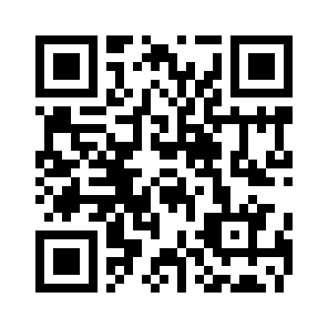

# Java Script Kiddie 2

> The image link appears broken... twice as badly... https://2019shell1.picoctf.com/problem/37897 or http://2019shell1.picoctf.com:37897
> Hints: This is only a JavaScript problem.

This problem is very similar to [Java Script Kiddie](/problems/Java-Script-Kiddie), so we recommend reading that writeup first. Just like the previous one, we have a textbox and a submit button. The javascript is slightly different:

```js
var bytes = [];
$.get("bytes", function(resp) {
	bytes = Array.from(resp.split(" "), x => Number(x));
});

function assemble_png(u_in){
	var LEN = 16;
	var key = "00000000000000000000000000000000";
	var shifter;
	if(u_in.length == key.length){
		key = u_in;
	}
	var result = [];
	for(var i = 0; i < LEN; i++){
		shifter = Number(key.slice((i*2),(i*2)+1));
		for(var j = 0; j < (bytes.length / LEN); j ++){
			result[(j * LEN) + i] = bytes[(((j + shifter) * LEN) % bytes.length) + i]
		}
	}
	while(result[result.length-1] == 0){
		result = result.slice(0,result.length-1);
	}
	document.getElementById("Area").src = "data:image/png;base64," + btoa(String.fromCharCode.apply(null, new Uint8Array(result)));
	return false;
}
```
The AJAX query for [`bytes`](bytes.txt) is identical, although the data is obviously different. The rest of the program is nearly the same in that `bytes` is used as a 2D array with 16 columns. However, we notice the key is twice as long: the key now takes two digits for each column to determine how much to shift. We can write a similar python script for visualization purposes:

```python
def tohex(a):
	return "{:02x}".format(a)

f = open("bytes.txt", "r")
bytelist = map(int, f.read().split(" "))
f.close()

key = "00000000000000000000000000000000"
result = [0 for x in bytelist]
SIZE = 16
for i in range(SIZE):
	shift = int(key[i*2:(i+1)*2])
	for j in range(len(result) / SIZE):
		result[(j*SIZE + i)] = bytelist[(((j+shift)*SIZE) % len(bytelist)) + i]

for i in range(len(result) / SIZE):
	print ' '.join(map(tohex, result[i*SIZE:(i+1)*SIZE]))
```
Just as in the previous problem, we must have the first row look like this:
```
89 50 4e 47 0d 0a 1a 0a 00 00 00 0d 49 48 44 52
```
Additionally, we can use the constraints of the second row as in the previous problem. Thus, we determine the key will be of the form `010600050109030600AABB0101050600` where `AA = 06,07` and `BB = 04,05`. By testing each of the four options, we find that the key is `01060005010903060007050101050600`, which gives us the following QR code:



The QR [decodes](https://zxing.org/w/decode.jspx) to the flag:

> `picoCTF{9064bc1bb5f8b7bd526686a311bfc18c}`