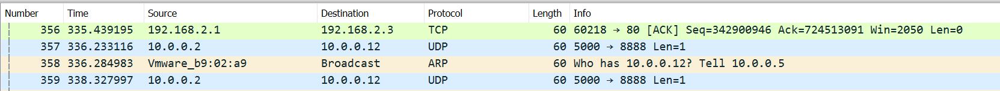
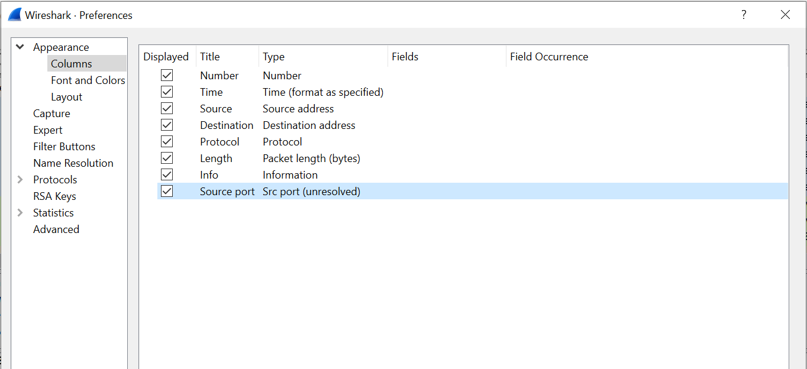
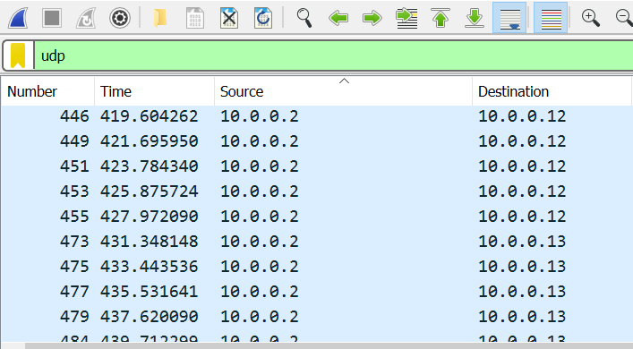
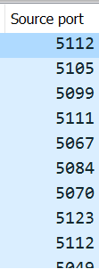
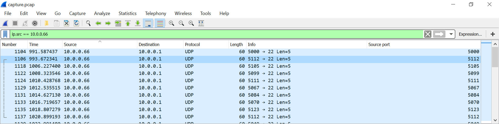

# shark on wire 2

> We found [this](capture.pcap) packet capture. Recover the flag that was pilfered from the network. You can also find the file in `/problems/shark-on-wire-2_0_3e92bfbdb2f6d0e25b8d019453fdbf07`.

Since its predecessor, shark on wire 1, involved following the UDP stream, that is the first step we should take to solve this. \
`Analyze -> Follow -> UDP Stream` \
\
There are 66 UDP streams total and two fake flags: \
In `udp.stream eq 6`, the stream contains `kfdsalkfsalkico{N0t_a_fLag}` \
In `udp.stream eq 7`, the stream contains `icoCTF{StaT31355e` (Note: UDP packets are stateless though this information isn't particularly relevant to solving the problem.) \
\
Unfortunately, this problem is not as simple as shark on wire 1. The flag was not simply waiting for us in the UDP stream. \
\
After searching the UDP packets, and briefly checking the TCP packets just in case, it could be concluded that the flag was not going to be 
in ascii or it would've been found. It was time to start searching for hex or decimal that could be converted into our flag. The data and checksums
of the UDP packets proved to be a dead end yet again so it was necessary to get creative with the search.\
\
What most likely tripped some people up was that the default Wireshark preferences do not include the columns necessary to solve this problem. \
\
By columns, I'm referring to these: \
 \
To edit the columns, I went to \
`Edit -> Preferences -> Appearance -> Columns` \
and added `Souce port` to my list so that it looked like this: 
 \
\
Applying a filter to the packets so that we are only viewing UDP packets and sorting them by source IP address in decending order looks like this: \
 \
Scrolling through the source ports, we see something interesting. \
 \
This is very unusual (especially considering all the packets came from the same source IP address). \
\
Isolating the source IP address, we get something that looks like this: \
 \
Using just a basic decimal to ascii converter online, we find that `112` converts to `p`. Huh. We keep going and discover that `105` converts to `i` and `099` converts to `c`. We could
do this by hand and wouldn't need any tools besides Wireshark and the online converter, but I'm a lazy person so I wrote a bash script to do this for me.
```bash
#!/bin/bash 

tshark -r capture.pcap -Y "udp" -T fields -e udp.srcport -Y ip.src==10.0.0.66 > ports.txt
ARRAY=(`cat ports.txt`)
arrayindex=0
flag=""
chr() {
  printf \\$(printf '%03o' $1)
}


for i in "${ARRAY[@]}"
do
   portnum=( "${ARRAY[arrayindex]}" )
   decimalportnum=${portnum:1}
   if [[ ${decimalportnum:0:1} == "0" ]]
   then
      decimalportnum=${decimalportnum:1}
   fi
   flagchar=(`chr $decimalportnum`)
   flag+=$flagchar
   arrayindex=$((arrayindex+1))
done

echo $flag
```
Running this on our bash shell, we get the flag: \
> `picoCTF{p1LLf3r3d_data_v1a_st3g0}`